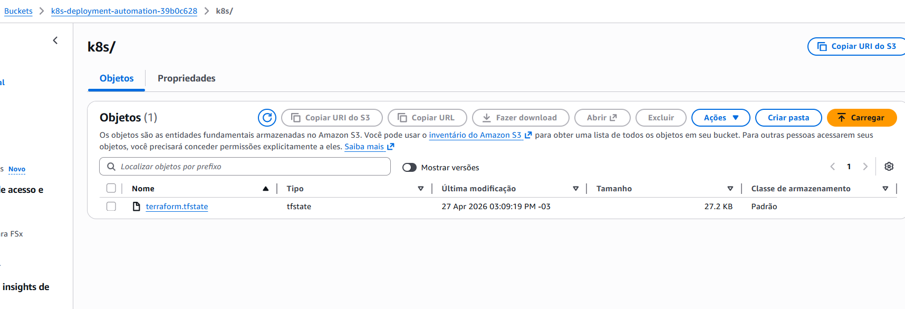
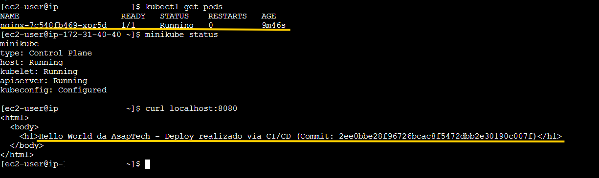

# Kubernetes Deployment Automation

Este projeto demonstra a criação de uma infraestrutura totalmente automatizada e reproduzível na AWS, utilizando Terraform, Kubernetes (Minikube), Helm e GitHub Actions com runner self-hosted.

---

## Tecnologias Utilizadas


---

## Arquitetura

- EC2 provisionada via Terraform  
- Cluster Kubernetes com Minikube inicializado automaticamente via user_data  
- Runner self-hosted do GitHub Actions executando na EC2  
- Deploy automatizado da aplicação via Helm  
- Backend remoto do Terraform em S3 com versionamento  

---

## Estrutura do Repositório

```
.
├── bootstrap/              # Criação do bucket S3 (backend Terraform)
├── terraform/              # Infraestrutura principal (EC2 + Kubernetes)
├── charts/nginx-app        # Helm Chart da aplicação
├── .github/workflows       # Pipeline CI/CD
├── docs/                   # Evidências do projeto
└── README.md
```

---

## Provisionamento da Infraestrutura

### 1. Criar bucket S3 (backend Terraform)

```bash
cd bootstrap
terraform init
terraform apply
```

Copie o output:

```
bucket_name = <nome-gerado>
```

---

### 2. Inicializar Terraform com backend remoto

```bash
cd ../terraform

terraform init \
  -backend-config="bucket=<nome-do-bucket>"
```

---

### 3. Provisionar ambiente

```bash
terraform apply
```

Recursos criados automaticamente:

- EC2 com Docker, Minikube, Kubectl e Helm  
- Runner self-hosted configurado automaticamente  
- Cluster Kubernetes pronto para uso  

---

## Pipeline CI/CD

O pipeline é executado automaticamente a cada push na branch `main`.

### Etapas

1. Checkout do código  
2. Validação do Helm Chart (`helm lint`)  
3. Configuração do acesso ao cluster Kubernetes (Minikube)  
4. Deploy da aplicação via Helm  

```bash
helm upgrade --install nginx .
```

---

## Aplicação

A aplicação consiste em um Nginx com conteúdo dinâmico configurado via Helm.

A mensagem exibida é definida por parâmetro:

```bash
--set message="Hello World da AsapTech - Deploy realizado via CI/CD (Commit: <SHA>)"
```

Essa mensagem é injetada no `index.html` via ConfigMap.

---

## Validação

Como o Service está configurado como ClusterIP, a aplicação não é exposta externamente. A validação deve ser realizada diretamente na instância EC2.

### 1. Acessar a instância via SSM

```bash
aws ssm start-session --target <INSTANCE_ID>
```

---

### 2. Verificar se o Minikube está rodando

```bash
minikube status
```

Saída esperada:

```
host: Running
kubelet: Running
apiserver: Running
```

---

### 3. Verificar cluster Kubernetes

```bash
kubectl get nodes
```

Saída esperada:

```
minikube   Ready
```

---

### 4. Verificar pods em execução

```bash
kubectl get pods
```

Saída esperada:

```
nginx-xxxxx   1/1   Running
```

---

### 5. Validar a aplicação

```bash
kubectl port-forward svc/nginx 8080:80
```

Em outro terminal na mesma instância:

```bash
curl localhost:8080
```

Saída esperada:

```html
<html>
  <body>
    <h1>Hello World da AsapTech - Deploy realizado via CI/CD (Commit: ...)</h1>
  </body>
</html>
```

---

## Decisões Técnicas

- Uso de Service do tipo ClusterIP  
- Exposição da aplicação via port-forward para validação interna  
- Utilização de runner self-hosted para execução do pipeline diretamente na EC2  
- Separação entre bootstrap (S3) e infraestrutura principal  

---

## Evidências

### Backend Terraform (S3)

O bucket S3 utilizado como backend remoto do Terraform foi criado com versionamento habilitado:



---

### Execução do Pipeline CI/CD

Execução do workflow no GitHub Actions realizando deploy via Helm no runner self-hosted:



---